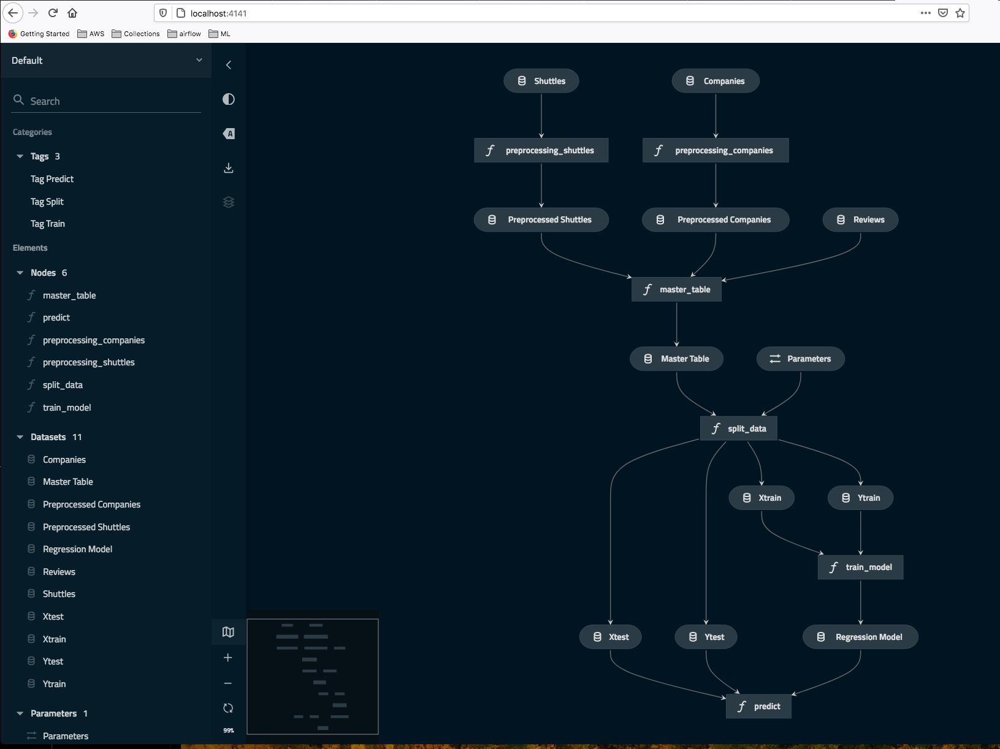
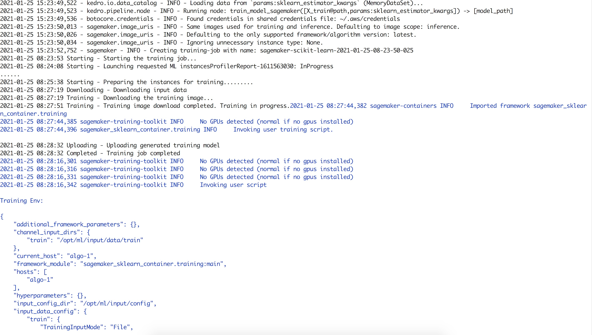
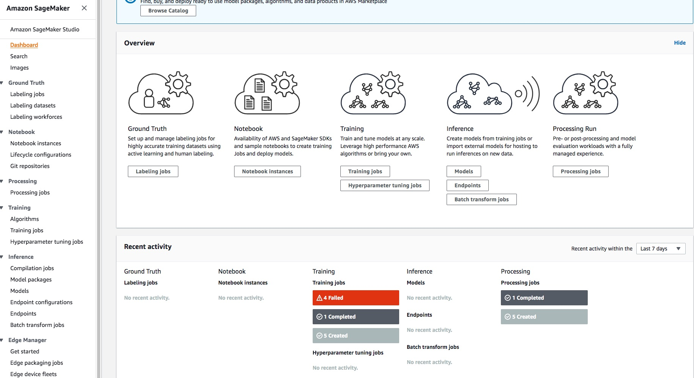
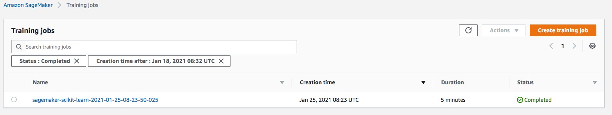

# Kedro AWS SageMaker
    Integate Amazon AWS SageMaker into the Kedro pipeline.
    Build machine learning pipelines in Kedro and while taking advantage of
    the power of SageMaker for potentially compute-intensive machine learning tasks.

### Prerequisites
+ Kedro 0.16.6
+ S3 bucket & SageMaker
+ scikit-learn 0.23.0
+ pickle5 0.0.11

### Issues
+ Could not move S3 objects to another region in AWS SageMaker
    ```
    File "/usr/local/lib/python3.7/site-packages/kedro/pipeline/node.py", line 433, in run
    raise exc
    File "/usr/local/lib/python3.7/site-packages/kedro/pipeline/node.py", line 424, in run
        outputs = self._run_with_list(inputs, self._inputs)
    File "/usr/local/lib/python3.7/site-packages/kedro/pipeline/node.py", line 471, in _run_with_list
        return self._decorated_func(*[inputs[item] for item in node_inputs])
    File "/Users/nhatthai/Code/kedro-aws-sagemaker/example/src/example/pipelines/data_science/nodes.py", line 104, in train_model_sagemaker
        sklearn_estimator.fit(inputs=inputs, wait=True)
    File "/usr/local/lib/python3.7/site-packages/sagemaker/estimator.py", line 657, in fit
        self.latest_training_job = _TrainingJob.start_new(self, inputs, experiment_config)
    File "/usr/local/lib/python3.7/site-packages/sagemaker/estimator.py", line 1420, in start_new
        estimator.sagemaker_session.train(**train_args)
    File "/usr/local/lib/python3.7/site-packages/sagemaker/session.py", line 562, in train
        self.sagemaker_client.create_training_job(**train_request)
    File "/usr/local/lib/python3.7/site-packages/botocore/client.py", line 357, in _api_call
        return self._make_api_call(operation_name, kwargs)
    File "/usr/local/lib/python3.7/site-packages/botocore/client.py", line 676, in _make_api_call
        raise error_class(parsed_response, operation_name)
    botocore.exceptions.ClientError: An error occurred (ValidationException) when calling the CreateTrainingJob operation:
    No S3 objects found under S3 URL "s3://kedro-data" given in input data source.
    Please ensure that the bucket exists in the selected region (us-east-1),
    that objects exist under that S3 prefix,
    and that the role "arn:aws:iam::783560535431:role/SageMaker-ExecRole" has "s3:ListBucket" permissions on bucket "kedro-data".
    Error message from S3: The bucket is in this region: ap-southeast-1.
    Please use this region to retry the request
    ```
    Currently, us-east-1 region is default

    + Fixed: set region=ap-southeast-1 into ~/.aws/config file.

### Results
+ Kedro Visualise Pipelines
    

+ Kedro AWS SageMaker
    

+ Amazon SageMaker Completed
    

+ Amazon SageMaker Detail
    


### References
+ [Deployment on AWS SageMaker](https://kedro.readthedocs.io/en/0.16.6/10_deployment/08_aws_sagemaker.html)

+ [Scikit learn Estimator](https://sagemaker.readthedocs.io/en/stable/frameworks/sklearn/sagemaker.sklearn.html#scikit-learn-estimator)